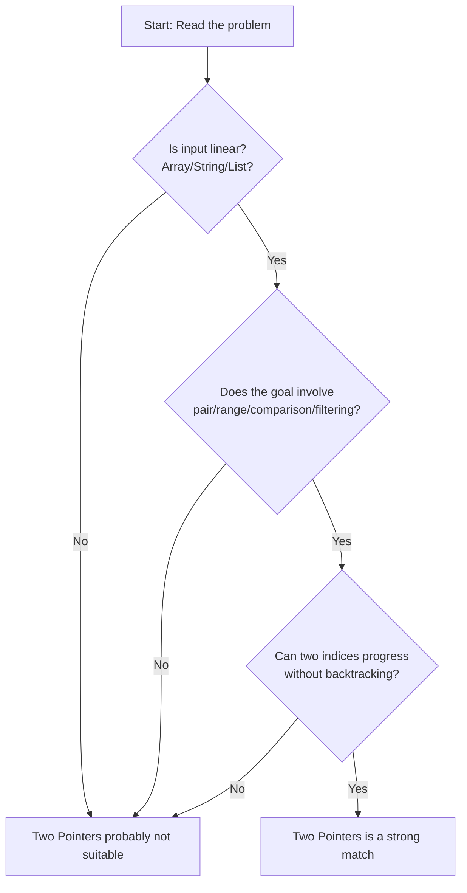
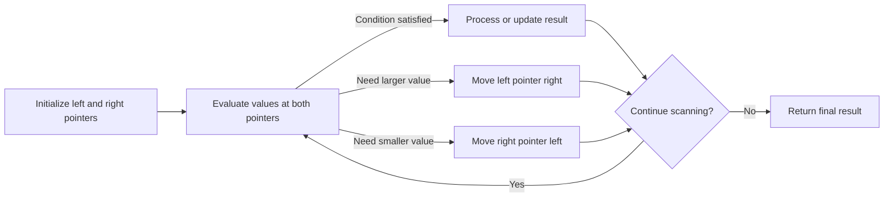
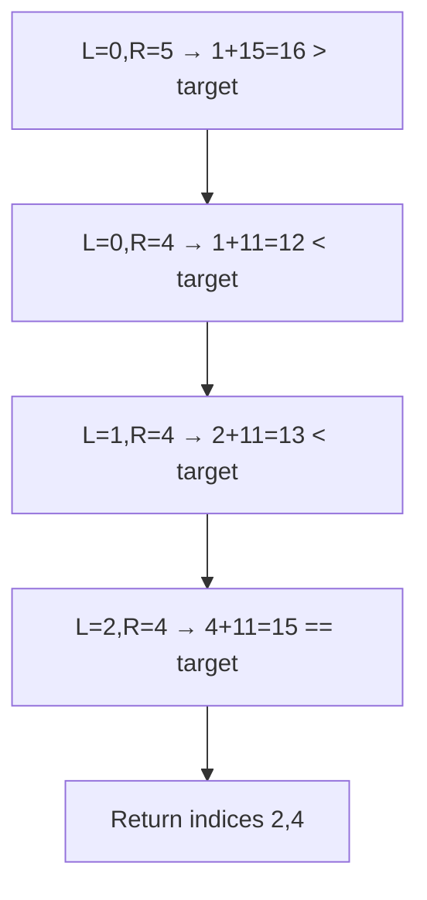

# Pattern — Two Pointers

---

## 1. When to Apply

Use the Two Pointers technique if most of the following are true:

- Input is a linear sequence (array / string / list).
- A solution requires comparing or relating two positions simultaneously.
- You need to avoid nested loops and solve in O(n) time.
- The logic is based on moving two indices based on comparisons or relationships.

### Pattern Selection Flow



---

## 2. Core Idea (High-Level Intuition)

Instead of checking every pair using nested loops (O(n²)), we track two positions and move them intelligently so each element is processed at most once.  
Pointer movement depends on the relationship between their values, leading to an O(n) solution.

---

## 3. Mental Model

Think of two markers sliding across a ruler:

- Both move in one direction toward a goal.
- Movement decisions come from comparisons or context.
- No pointer moves backward, so total work is minimal.

Two common forms:
- Left pointer + Right pointer (often used for sorted arrays, palindrome checks, max area problems)
- Slow pointer + Fast pointer (used for deduplication, cycle detection, in-place writing)

---

## 4. General Steps / Blueprint

```text
1. Initialize two pointers (either at both ends or both at start).
2. While pointers remain within valid bounds:
       evaluate relationship of values at pointers
       update result if needed
       move one of the pointers based on logic
3. Stop when pointers cross or condition satisfied
```

### Execution Flow



---

## 5. Time & Space Complexity

| Case | Time | Space | Explanation |
|------|------|-------|-------------|
| Typical | O(n) | O(1) | Two pointers move monotonically across array |
| Worst | O(n) | O(1) | No backtracking; only forward movement |
| Best | O(1) | O(1) | When result is found instantly |

---

## 6. Real Walkthrough Example

Problem: Given a sorted array, find indices of two numbers that add up to a target.

Input:
```
arr = [1, 2, 4, 7, 11, 15], target = 15
```

Pointer Walkthrough



Timeline View
```
Start: 1 + 15 = 16  → R--
1 + 11 = 12  → L++
2 + 11 = 13  → L++
4 + 11 = 15  → Done
```

---

## 7. Code Pattern (Reusable)

```python
def two_pointers(arr, target):
    left, right = 0, len(arr) - 1
    while left < right:
        s = arr[left] + arr[right]
        if s == target:
            return left, right
        elif s < target:
            left += 1
        else:
            right -= 1
    return None
```

---

## 8. Common Mistakes

- Applying Two Pointers to unsorted arrays when sorting is required first.
- Moving both pointers without reasoning, causing missed results.
- Assuming Two Pointers always means left/right — it also includes fast/slow scenarios.
- Using Two Pointers where HashMap yields simpler logic.

---

## 9. Interview Questions to Expect

- How can you recognize Two Pointers instantly from the prompt?
- Why does Two Pointers drop time from O(n²) to O(n)?
- When should Two Pointers not be used?
- Difference between left/right pointers and slow/fast pointers?

---

## 10. Practice Checklist

- [ ] Can identify Two Pointers from problem statement quickly
- [ ] Can write the implementation from memory
- [ ] Know when to move left vs. right pointer and why
- [ ] Solved at least:
      - Two Sum (sorted)
      - Valid Palindrome
      - Remove Duplicates
      - Container With Most Water
      - 3Sum
- [ ] Able to verbally justify pointer movement in each step

---

## Final Memory Hook

Two Pointers = Replace nested loops by sliding two indices in one pass based on value relationships.
